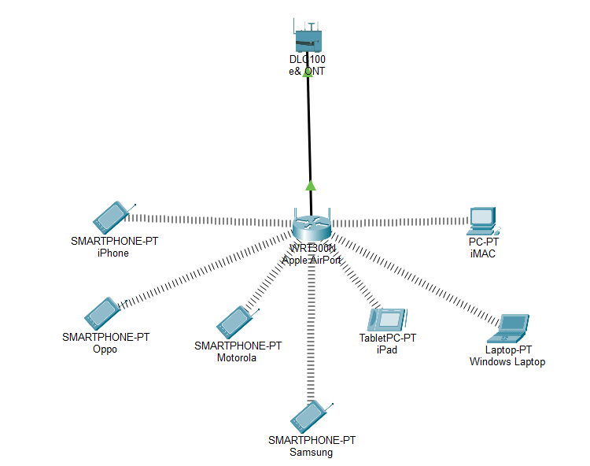
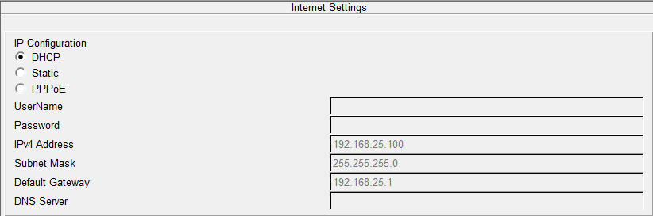
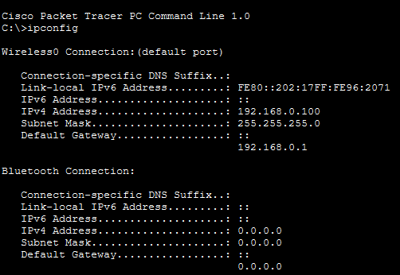

# Home Network Lab

**Date Completed:** 17 June 2026

**Course:** Cisco Getting Started with Cisco Packet Tracer

---

# Objective

Learn the Packet Tracer interface, understand basic network devices, and recreate a simplified version of my home network while investigating how devices obtain network connectivity through DHCP.

---

# Lab Environment

## Software

* Cisco Packet Tracer

## Devices Used

* Internet Cloud
* ONT (Optical Network Terminal)
* Apple AirPort Extreme (Wireless Router)
* Windows Laptop
* iMac
* iPad
* Smartphones

---

# Network Topology

## Home Network Recreation

### Device Inventory

| Device                | Type                  | Function                               |
| --------------------- | --------------------- | -------------------------------------- |
| Internet Cloud        | External Network      | Represents ISP and Internet            |
| ONT                   | Infrastructure Device | Converts fiber signal to Ethernet      |
| Apple AirPort Extreme | Wireless Router       | Provides Wi-Fi, DHCP, NAT, and routing |
| Windows Laptop        | End Device            | Client                                 |
| iMac                  | End Device            | Client                                 |
| iPad                  | End Device            | Client                                 |
| Smartphones           | End Devices           | Clients                                |

---

# Packet Tracer Concepts Learned

## Packet Tracer File Types

| File Type | Purpose                        |
| --------- | ------------------------------ |
| `.pka`    | Packet Tracer Activity         |
| `.pkt`    | Saved Network Topology         |
| `.pksz`   | Packet Tracer Tutored Activity |

## Packet Tracer Modes

### Logical Mode

Displays the logical network topology and connections between devices.

### Physical Mode

Displays the physical layout of devices, rooms, buildings, and network infrastructure.

---

# CLI Commands Practiced

| Command              | Description                     |
| -------------------- | ------------------------------- |
| `enable`             | Enter Privileged EXEC Mode      |
| `configure terminal` | Enter Global Configuration Mode |
| `hostname [name]`    | Change device hostname          |
| `end`                | Exit Configuration Mode         |

---

# Home Network Investigation

## Infrastructure Devices

### ONT (Optical Network Terminal)

An ONT connects a home to a fiber-optic Internet service and converts optical signals into Ethernet signals that can be used by networking devices.

**Functions:**

* Connects the home to the ISP network
* Converts fiber signals to Ethernet
* Passes connectivity to the router

**Real-world example:**
The e& fiber box in my home network functions as an ONT.

---

### Wireless Router

The Apple AirPort Extreme functions as the wireless router in my network.

**Functions:**

* Provides Wi-Fi connectivity
* Assigns IP addresses through DHCP
* Performs Network Address Translation (NAT)
* Routes traffic between local and external networks
* Acts as the default gateway

---

# Router Configuration Analysis

| Setting        | Value          |
| -------------- | -------------- |
| WAN IP Address | 192.168.25.100 |
| LAN IP Address | 192.168.0.1    |
| DHCP           | Enabled        |
| DNS            | Not Configured |

## Observation

The router has two separate IP addresses:

### WAN Address

`192.168.25.100`

Used to communicate with upstream networks and the ISP.

### LAN Address

`192.168.0.1`

Used by local devices as their default gateway.

This demonstrates how routers connect two different networks together.

---

# Client Device Analysis

| Setting         | Value         |
| --------------- | ------------- |
| IP Address      | 192.168.0.113 |
| Subnet Mask     | 255.255.255.0 |
| Default Gateway | 192.168.0.1   |
| DNS Server      | 0.0.0.0       |

## Observation

The laptop received an IP address automatically from the router.

The default gateway matches the router's LAN address:

`192.168.0.1`

This indicates that the router is acting as the gateway for devices on the local network.

---

# Key Networking Concepts Learned

## DHCP

Dynamic Host Configuration Protocol (DHCP) automatically assigns network settings to devices.

### Benefits

* Automatic IP assignment
* Reduced manual configuration
* Easier network management
* Consistent device connectivity

### Example

The Windows laptop automatically received:

* IP Address: `192.168.0.113`
* Default Gateway: `192.168.0.1`

from the AirPort DHCP service.

---

## WAN vs LAN

### WAN (Wide Area Network)

External-facing network connection.

Example:

`192.168.25.100`

### LAN (Local Area Network)

Internal network used by local devices.

Example:

`192.168.0.1`

---

## Default Gateway

A default gateway forwards traffic from the local network to external networks.

In this lab:

`Default Gateway = 192.168.0.1`

which is the AirPort Extreme router.

---

# SOC & DFIR Relevance

This lab introduced networking concepts that are commonly encountered during:

* Log analysis
* Security monitoring
* Incident response
* Network investigations
* SIEM analysis

### Key Takeaways

* DHCP logs can identify which device held a specific IP address.
* Network topology helps analysts understand communication paths.
* Gateway and routing concepts help trace network traffic.
* Understanding IP addressing is essential when investigating alerts.

---

# Lessons Learned

* An ONT and a router perform different functions.
* Routers typically have separate WAN and LAN interfaces.
* DHCP automatically assigns IP addresses to clients.
* End devices use the router as their default gateway.
* Packet Tracer can be used to model and investigate real-world networks.

---

# Files Included

| File                               | Purpose                        |
| ---------------------------------- | ------------------------------ |
| `home-network-lab.pkt`             | Packet Tracer network topology |
| `screenshots/topology.png`         | Network topology screenshot    |
| `screenshots/airport-config.png`   | Router configuration           |
| `screenshots/laptop-ip-config.png` | Client IP configuration        |

---

# Next Steps

* Cisco Networking Basics
* OSI Model
* TCP/IP Model
* IPv4 Addressing
* Subnetting Fundamentals
* DHCP Deep Dive
