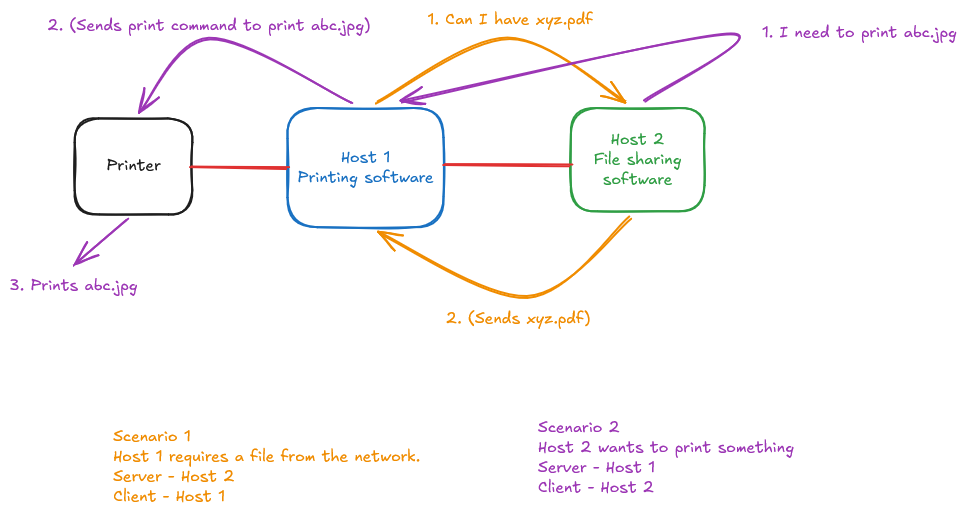

# Cisco Networking Basics — Modules 1 & 2

**Course:** Cisco Networking Academy — Networking Basics
**Date:** 19 Jun 2026
**Assessment results:** Module 1 — 100% · Module 2 — 100% (retake)

---

## Module 1 — Communication in a Connected World

### What I learned

- The internet is a worldwide collection of interconnected networks ("internetworks") cooperating to exchange information using common standards
- A local network is simply an interconnection of devices confined to a specific area — can be as small as two computers or as large as hundreds of thousands of devices
- Personal data falls into three categories, which matters for understanding privacy and data handling in security contexts:
  - **Volunteered data** — data you knowingly provide
  - **Inferred data** — data collected involuntarily based on activity
  - **Observed data** — data tracked passively, e.g. location services
- 8 bits = 1 byte (foundational unit conversion used throughout networking)

### Bandwidth vs Throughput

**Bandwidth** is the theoretical maximum capacity of a medium to carry data, measured in bits per second.

| Unit | Meaning |
|------|---------|
| Kbps | Thousands of bits per second |
| Mbps | Millions of bits per second |
| Gbps | Billions of bits per second |

**Throughput** is the *actual* data that moves through that medium at a given time — always less than or equal to bandwidth.

**The highway analogy (my own mental model):**

> Bandwidth = number of lanes on a highway (e.g. 10 lanes)
> Throughput = number of lanes actually moving during traffic (e.g. 5 lanes)

If a 4-lane highway feeds into a 1-lane bridge before opening back into a 4-lane highway, traffic gets stuck at the bridge — the whole route slows down regardless of how wide the rest of the road is. This is a **bandwidth constraint**: the narrowest point in the path determines the effective throughput of the entire connection, not the widest.

---

## Module 2 — Network Components, Types & Connections

### Clients & Servers

A modern computer can act as a **client**, a **server**, or both simultaneously.

- **Servers** run software that provides services to other hosts on the network (e.g. serving web pages, hosting email)
- **Clients** run software that consumes those services (e.g. a web browser, an email client)

### Peer-to-Peer (P2P)

**P2P network** — a host acts as client and server at the same time. Simplest example: two computers directly connected, one sharing files, the other sharing a printer.



**P2P application** — allows a host to act as client and server *within the same communication session*. Messaging apps are the clearest example: you send and receive simultaneously.

**Hybrid P2P** — resource sharing is decentralized, but an index of *where* resources live is stored centrally.

```
You → Index Server → "Who has this file?"
Index Server → Replies: Computer A, Computer B, Computer C
You ↔ Peers → Connects directly and downloads
```

This matters operationally: hybrid P2P explains why some file-sharing and botnet C2 architectures use a central lookup point even though the actual data transfer is fully decentralized — relevant context for later threat hunting work.

### Network Infrastructure

Three core categories of physical network infrastructure:

| Category | Examples |
|----------|----------|
| **End devices** | PCs, laptops, printers, phones — anything a user interacts with directly |
| **Intermediary devices** | Switches, routers, access points — devices that move traffic between end devices |
| **Network media** | Copper cable, fiber optic, wireless — the physical/wireless path data travels |

### ISP Connectivity Options

An ISP (Internet Service Provider) bridges a home/local network to the internet. The **internet backbone** — the core infrastructure connecting major ISPs to each other — runs primarily over fiber-optic cable.

| Connection type | Notes |
|----------------|-------|
| **Cable** | Shares coaxial cable with cable TV signal; high bandwidth, always-on |
| **DSL** | Uses telephone lines; splits into 3 channels — voice, download, upload (upload typically slower) |
| **Cellular** | Mobile data network |
| **Satellite** | Requires direct line-of-sight to a satellite dish |
| **Dial-up** | Uses a telephone line + modem; occupies the phone line entirely while connected |

---

## Why this matters for SOC / DFIR work

- Understanding bandwidth constraints helps explain anomalies in network traffic logs — a sudden throughput drop isn't always malicious, it could be a legitimate bottleneck
- Recognizing client/server roles is foundational to reading any network log — every connection in a log has a source (client) and destination (server) role
- Hybrid P2P architecture knowledge is directly relevant to understanding botnet and malware C2 structures later in the program
- ISP connection types matter when scoping an investigation — DSL vs cable vs cellular affects what's technically feasible for an attacker on a given connection